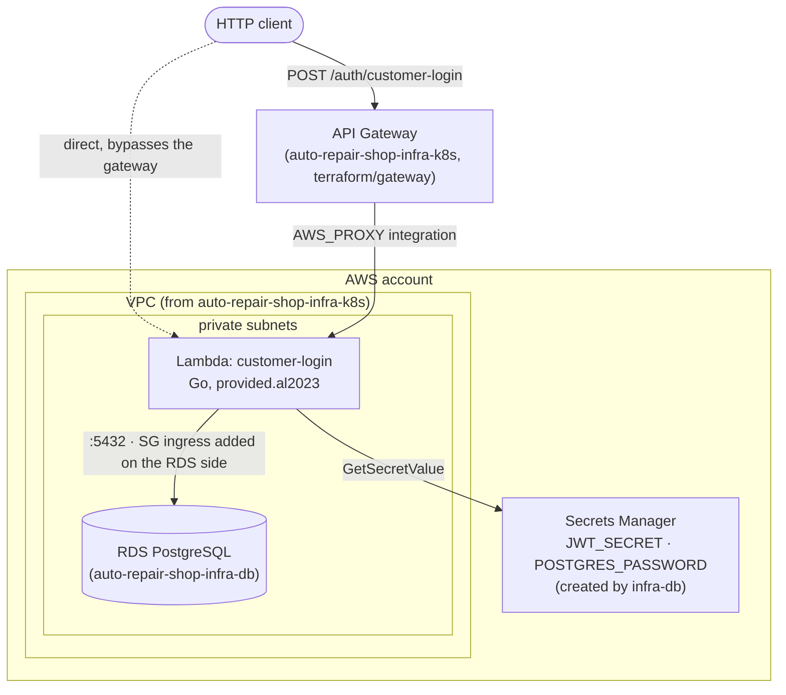

# auto-repair-shop-lambda-auth

Serverless (AWS Lambda) function that issues JWTs for customer logins in the
[auto-repair-shop](https://github.com/POS-FIAP-15SOAT-TEAM-DARK-MODE/auto-repair-shop)
app. Split into its own repository as part of a move to independently
deployable services, each with its own CI/CD.

## Scope

The original design for this lambda called for CPF validation, a customer
existence/status check, and token issuance. After scoping the work (see
[infra-k8s issue #4](https://github.com/POS-FIAP-15SOAT-TEAM-DARK-MODE/auto-repair-shop-infra-k8s/issues/4)),
the team narrowed it down to **token issuance** as the piece that actually
matters for this project right now. This lambda still does a minimal Postgres
lookup (CPF → `user_id` → roles) rather than skipping the database
entirely — not because it's required, but because the app's
`accept`/`reject` service-order endpoints scope by
`customer.user_id`, and a token with a fabricated `user_id` would silently
break those for any customer who logged in this way. No CPF format
validation and no "customer status" check are performed (there is no status
column on `customer` in the schema today).

## Request / response

```
POST /auth/customer-login   (via the API Gateway in auto-repair-shop-infra-k8s;
                              also reachable directly on the lambda's own
                              Function URL — see "Testing an apply" below)
Content-Type: application/json

{ "cpf": "52998224725" }
```

```json
200 { "token": "<jwt>", "expires_in": 86400 }
404 { "code": 404, "errors": ["customer not found"] }
400 { "code": 400, "errors": ["cpf is required"] }
```

The issued token is byte-compatible with the main app's own login endpoint:
same claim shape (`user_id`, `roles`), same `HS256` signing, same
`JWT_SECRET` (read from the same Secrets Manager entry
`auto-repair-shop-infra-db` already creates) — the app's existing auth
middleware accepts it unmodified, no changes needed on that side.

## Technologies

- Go (`provided.al2023` custom runtime, `arm64`), `github.com/aws/aws-lambda-go`
- `github.com/golang-jwt/jwt/v5` — same library/version as the main app
- `github.com/lib/pq` — same Postgres driver as the main app
- `go.uber.org/zap` — structured JSON logging, same convention as the main app (see `.ai/rules/observability.md` there); CPF is never logged, only derived non-PII fields (`user_id`, `roles`)
- Terraform (>= 1.10), AWS provider (~> 6.0)
- AWS: Lambda, Secrets Manager (read-only), VPC (private subnets, for the
  Postgres connection), CloudWatch Logs
- GitHub Actions (OIDC, or static Learner Lab credentials — same
  auto-detected fallback as the sibling infra repos)

## Structure

```
cmd/lambda/            # entrypoint (lambda.Start)
internal/authtoken/    # JWT claim shape + HS256 signing, mirrors the app's internal/pkg/auth
internal/repository/   # two read-only Postgres queries: cpf -> user_id, user_id -> roles
internal/secrets/      # Secrets Manager fetch of JWT_SECRET/POSTGRES_PASSWORD
terraform/
├── versions.tf         # backend (S3, key = lambda-auth/terraform.tfstate — same bucket as the other infra repos)
├── variables.tf
├── remote_state.tf      # reads VPC/subnets from infra-k8s, db host/secret ARN from infra-db
├── lambda.tf             # function, security group, IAM (skipped under manage_iam=false)
└── outputs.tf
```

## Deploy — driven from GitHub Actions

Depends on `auto-repair-shop-infra-k8s`'s `aws` state and
`auto-repair-shop-infra-db`'s state already being applied for the target
workspace (this repo reads both via `terraform_remote_state`).

**Prerequisites:**
1. `auto-repair-shop-infra-k8s`: `bootstrap` + `shared` + `aws` states applied.
2. `auto-repair-shop-infra-db`: applied (this repo reads its `db_host`,
   `app_secret_arn`, and `lambda_access_security_group_id` outputs — the
   last of these is the security group this lambda's function attaches to
   for RDS access; owned in `infra-db`, not here, to avoid a circular
   cross-repo dependency between the two states).
3. Add the same repository secrets used by the sibling infra repos
   (`AWS_ACCESS_KEY_ID` / `AWS_SECRET_ACCESS_KEY` / `AWS_SESSION_TOKEN` for
   Learner Lab; or wire up the `infra` GitHub Environment's
   `AWS_TERRAFORM_ROLE_ARN` on non-restricted accounts).

**Deploy:** Actions tab → **"Deploy (Terraform)"** → Run workflow →
`environment=stg`, `action=plan` first, then `action=apply`. The `build` job
cross-compiles the Go binary for `linux/arm64`, zips it, and hands it to the
`deploy` job's `terraform apply`. No manual security-group wiring needed —
RDS access is resolved automatically via `infra-db`'s remote state.

PRs touching `**.go` or `terraform/**` get automatic `go test`/`vet`/build +
`terraform fmt`/`validate` (no credentials required).

### Restricted accounts (AWS Academy Learner Lab)

Same auto-detected degraded mode as the sibling infra repos:
`manage_iam=false` reuses `LabRole` as the lambda's execution role instead of
creating a dedicated IAM role/policy.

## Local development

```bash
go test ./...
GOOS=linux GOARCH=arm64 CGO_ENABLED=0 go build -o build/bootstrap ./cmd/lambda
```

Ported the applicable conventions from the main app's `.ai/rules/` (Go
idioms, testing structure, structured logging, Conventional Commits,
pre-commit hooks) — see `.pre-commit-config.yaml`. Skipped what's monolith-
specific (layered architecture/UoW, RBAC endpoint table, migrations) since
this is a single-purpose function, not a layered app. Install the hooks with:

```bash
pip install pre-commit  # or: brew install pre-commit
pre-commit install
```

No local Postgres path — this lambda only ever talks to the shared RDS
instance provisioned by `auto-repair-shop-infra-db`, reachable only from
inside the VPC. For local iteration, unit tests (`internal/authtoken`,
`internal/repository`, mocked DB via `go-sqlmock`) cover the logic without
needing a live database.

## Testing an apply

Once deployed, the Terraform output `invoke_url` gives a public HTTPS
endpoint (AWS Lambda Function URL) you can hit directly, independent of the
API Gateway work in `auto-repair-shop-infra-k8s`:

```bash
curl -X POST "$INVOKE_URL" -H "Content-Type: application/json" \
  -d '{"cpf":"52998224725"}'
```

## Swagger / Postman

OpenAPI spec for this lambda's one route: [`docs/openapi.yaml`](docs/openapi.yaml).
No separate Postman collection — the spec is small enough that the `curl`
example under "Testing an apply" above covers the same ground.

## Architecture



## Related repositories

- [auto-repair-shop](https://github.com/POS-FIAP-15SOAT-TEAM-DARK-MODE/auto-repair-shop) — the application whose auth middleware accepts tokens issued here
- [auto-repair-shop-infra-k8s](https://github.com/POS-FIAP-15SOAT-TEAM-DARK-MODE/auto-repair-shop-infra-k8s) — VPC/EKS this lambda's network config is read from; its `gateway` state routes `POST /auth/customer-login` to this lambda
- [auto-repair-shop-infra-db](https://github.com/POS-FIAP-15SOAT-TEAM-DARK-MODE/auto-repair-shop-infra-db) — RDS instance and the app secret this lambda reads from
